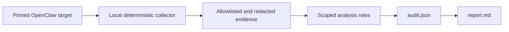

# OpenClaw Drift Audit

[](https://github.com/benmillerat/openclaw-drift-audit/actions/workflows/ci.yml)
[](LICENSE)

`openclaw-drift-audit` is an independent Codex skill for auditing long-lived OpenClaw installations. It discovers the installed components first, derives version- and context-specific baselines from owner sources, and reports configuration, provenance, migration, dependency, source, and artifact drift without applying repairs.

> [!IMPORTANT]
> This project is a Public Preview. It is not an official OpenClaw diagnostic, is not endorsed by OpenClaw, and must not be described as a complete or "full" audit. Every run reports its actual capabilities and Coverage Gaps.

## Why this exists

An OpenClaw installation can remain operational while carrying old configuration through many upgrades. A setting that was valid for an older host or plugin can later become deprecated, ignored, out of range, or incompatible with a downstream component.

This project distinguishes those cases instead of collapsing them into a single pass/fail score:

- recommendation drift;
- runtime-default differences;
- accepted-constraint violations;
- deprecated, replaced, removed, or no-op options;
- source and artifact drift;
- dependency-resolution drift;
- unknown or conflicting baselines;
- evidence-backed compatibility cascades.

A drift is visible, but it is not automatically an error or the cause of an observed problem.

## Safety model

The default `offline-core` profile is audit-only:

- no intentional mutation of the selected OpenClaw target;
- no OpenClaw `doctor`, `triage`, update, repair, restart, or migration command;
- no plugin or target-code execution;
- no network access;
- no persistent audit artifact unless a destination and retention policy are explicitly authorized;
- complete raw configuration is handled only by the local deterministic collector;
- models receive only allowlisted, secret-redacted structures;
- unresolved evidence becomes a Coverage Gap, never an implicit pass.

Physical zero-write behavior can only be claimed when the operating system also enforces a read-only boundary.



`audit.json` is the canonical result. `report.md` is generated from it and contains no independent evaluation logic.

## Public Preview 0.1 scope

Included:

- installation discovery and explicit target pinning;
- authored configuration and include resolution;
- OpenClaw and plugin provenance;
- exact-version, release-channel-aware Dynamic Baselines;
- relevant migration-chain reconstruction;
- direct static dependency consistency checks;
- source and artifact state inspection;
- structured, portable-redacted exports;
- non-executing Repair Handoffs.

Deferred or conditional:

- live runtime and service probes;
- persistent Source Evidence Cache;
- persistent Intent Ledger;
- generalized Evidence Bundles;
- automatic repairs;
- deep logs, memories, and transcript analysis, which remains finding-triggered.

## Requirements

- Codex with local filesystem access;
- Node.js 22.13 or newer;
- read access to the selected OpenClaw installation;
- `git` when source-checkout evidence is available.

The skill has no third-party runtime package dependencies.

## Install

While the repository is private, cloning requires an authorized GitHub account. Once public, the same command works without private-repository access:

```sh
git clone https://github.com/benmillerat/openclaw-drift-audit.git ~/.codex/skills/openclaw-drift-audit
cd ~/.codex/skills/openclaw-drift-audit
npm test
```

Restart or reload Codex after adding the skill if it is not discovered immediately.

## Use with Codex

Start with a direct request:

```text
Use $openclaw-drift-audit to audit this OpenClaw installation for version-aware configuration and component drift. Do not apply repairs.
```

The skill first discovers candidate installations. If more than one package or runtime identity is plausible, it asks you to select one rather than combining their evidence.

## Run the deterministic scanner directly

Discover candidates without creating a file:

```sh
cd ~/.codex/skills/openclaw-drift-audit
node scripts/collect-evidence.mjs --profile offline-core \
  | node scripts/slice-evidence.mjs --bundle
```

For a selected target, supply explicit paths:

```sh
node scripts/collect-evidence.mjs \
  --state-dir ~/.openclaw \
  --config ~/.openclaw/openclaw.json \
  --package-root /absolute/path/to/openclaw \
  --runtime-cwd /absolute/evidenced/runtime-directory \
  --profile offline-core \
  | node scripts/slice-evidence.mjs --bundle
```

Only provide `--runtime-cwd` when the service or Gateway working directory is actually known. If it is not known, omit it and retain the resulting Coverage Gap. Persistent export intentionally fails closed when configured relative target paths cannot be resolved safely.

See [installation and provenance](references/installation-and-provenance.md) for target selection and [the export contract](references/export-schema-0.1.md) for the optional `evidence.json` to `audit.json` to `report.md` chain.

## Evidence and baseline rules

Baselines are derived for the exact installed component version, release channel, effective scope, and Operating Context Profile. They are rebuilt for each audit instead of reusing a previously calculated answer.

Evidence priority depends on the claim:

1. installed manifest, build, source, and artifact evidence;
2. exact-version schema, validator, resolver, tests, or tagged source;
3. versioned component-owner documentation and releases;
4. shipped commits and backports;
5. merged but unshipped pull requests or closed issues as Candidate Evidence;
6. community reports as symptom evidence requiring local corroboration.

If sufficiently authoritative sources conflict, the result is a Baseline Conflict. If suitable sources are missing, the result is an Unknown Baseline.

The project's precise audit vocabulary is maintained in [the design glossary](docs/GLOSSARY.md). Durable safety and architecture decisions are recorded under [`docs/adr/`](docs/adr/).

## Verified release-gate coverage

The initial release gate was completed on 2026-09-03:

| Platform | OpenClaw | Installation | Verified capability |
|---|---|---|---|
| macOS arm64, Node 26 | 2026.8.2 | customized source checkout | Public Preview offline-core and export pipeline |
| macOS arm64, Node 26 | 2026.8.1 | npm package with isolated state | Public Preview offline-core and export pipeline |

Linux, Windows, Nix, containers, and live-runtime capabilities remain unverified. Fixture and CI success on another platform does not turn it into a verified real-installation combination.

## Development

```sh
npm test
find scripts -type f -name '*.mjs' -print0 | xargs -0 -n1 node --check
node scripts/fingerprint-skill.mjs --root .
```

The test suite covers deterministic collection, configuration includes, provenance, direct dependencies, redaction, JSON Pointer privacy, schema validation, real OS pipes, canonical export, and Markdown rendering.

Read [CONTRIBUTING.md](CONTRIBUTING.md) before proposing a change. Security-sensitive findings belong in [private vulnerability reporting](SECURITY.md), not a public issue.

## Project status

- Release line: `0.1.x`, Public Preview
- Canonical audit schema: `0.1.1`, explicitly evolvable
- CI or policy exit-code contract: not defined
- Automatic repair: not supported

See [CHANGELOG.md](CHANGELOG.md) for shipped changes and [the public-release checklist](docs/PUBLIC-RELEASE-CHECKLIST.md) before changing repository visibility.

## License

OpenClaw Drift Audit is available under the [MIT License](LICENSE).
